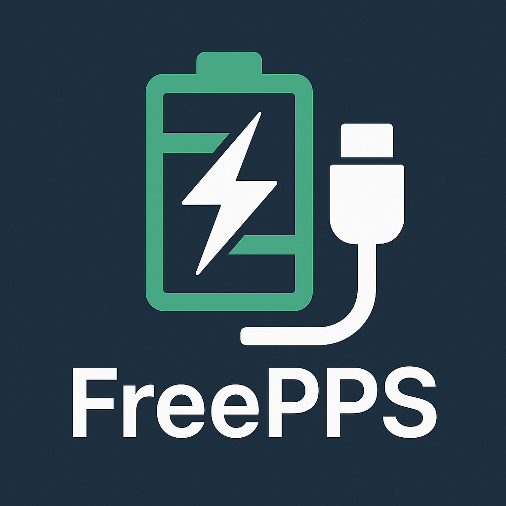

**English** | [简体中文](https://github.com/Seyud/FreePPS/blob/main/docs/README.md)

# FreePPS 🔋⚡

**Enable public PPS fast charging support for Xiaomi/Mi devices!**

## ✨ Module Overview

FreePPS is a module specifically designed for Xiaomi/Mi devices that can **unlock and enable public PPS (Programmable Power Supply) fast charging protocol support**, giving your device better compatibility!

> ⚠️ **Important Note**: After enabling public PPS support, the device will **automatically disable MIPPS (Xiaomi proprietary PPS protocol) support**. The two protocols conflict and cannot be enabled simultaneously. Please choose the appropriate protocol based on your charging device.

> 💡 **Special Thanks**: Technical solution support provided by Coolapk @低线阻狂魔 and Coolapk @花橋桥

## 🚀 Key Features

- ✅ **PPS Protocol Unlock** - Enable public PPS fast charging support
- 🔄 **File Monitoring** - Real-time monitoring of key configuration file changes
- ⚙️ **Status Toggle** - Quick enable/disable PPS support through module control buttons
- 🔛 **Temporary Control** - Use module switches for compatibility switching of PPS support status

## 🙏 Acknowledgments

- **Coolapk @低线阻狂魔**, **Coolapk @花橋桥** - Node solution support
- **All test users** - Effective feedback and suggestions

---

**⚡ Let every Xiaomi device enjoy free charging experience!** 🔋

> 💝 If this module has been helpful to you, please give it a Star to show your support!